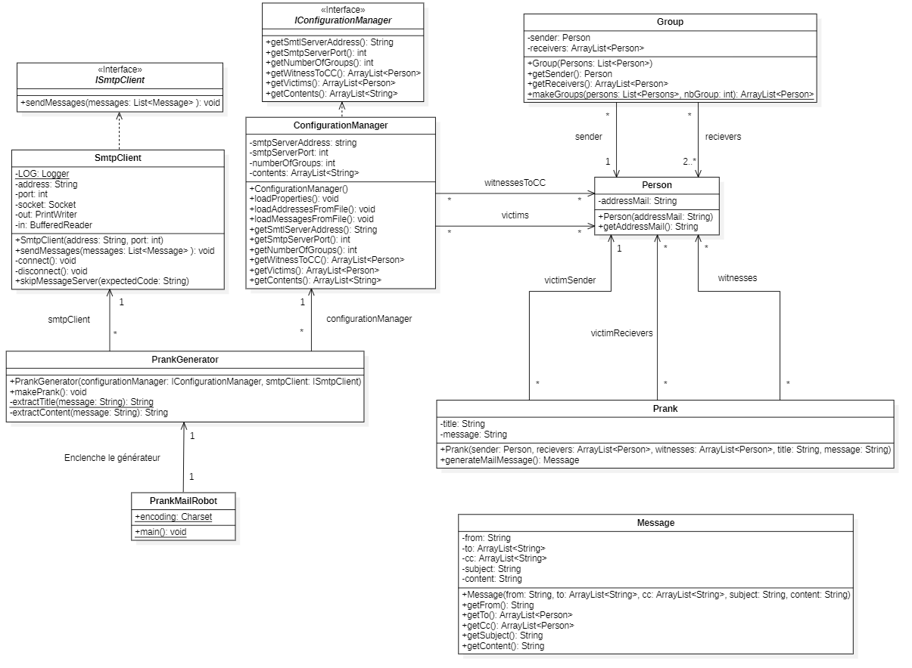

# Teaching-HEIGVD-RES-2021-Labo-SMTP
## Auteurs
- Forestier Quentin
- Herzig Melvyn

## Description du projet
PrankMailRobot est un programme Java permettant d'envoyer des emails forgés.
Le robot est entièrement configurable au travers des fichiers de configuration dans le dossier config.
Il est possible de configurer :

- Le serveur smtp à utiliser (adresse / port)
- Les adresses des victimes.
- Les adresses des personnes en copie.
- Les messages qui seront sélectionnés aléatoirement.

L'application est packagée dans le dossier <u>PrankMailRobotPackage.zip</u>. Toutes les manipulations sont à effectuer
depuis ce dossier (une fois dézzipé).


## Serveur SMTP mock
### Qu'est-ce que c'est que cette chose? 
Un mock est un composant logiciel qui simule un composant "réel". Il permet de mettre rapidement en place
une infrastructure de test afin de s'astreindre des contraintes liées aux composants réels.

### MockMock
MockMock est le composant qui simule un serveur SMTP local. Il stocke les emails qu'il reçoit et offre une interface graphique web pour consulter l'état de la boîte de réception.

Grâce à lui, nous n'inondons pas les vrais serveurs SMTP avec du trafic inutile et nous pouvons tester la réception de nos emails sans risque qu'ils soient considérer comme des spams.

### Utilisation
Pour utiliser le serveur MockMock, il faut avoir [Docker](https://www.docker.com/) installé sur votre ordinateur. 

Dans le dossier <u>PrankMailRobotPackage/Docker</u>:

 - Exécuter le script `build-image.sh` pour créer l'image docker.
 - Exécuter le script `run-container.sh`pour démarrer l'image Docker dans un conteneur.

À ce moment, le serveur MockMock est en fonction.
Il est accessible via deux ports:

- **2525** port SMTP pour l'envoi des emails
- **8282** port HTTP pour consulter l'état de la boîte mail du serveur. 

>Pour rappel: il est accessible avec l'adresse "localhost"  ou "127.0.0.1"

Pour accéder à la boîte mail, depuis un navigateur web, utiliser "localhost:8282"


## Configuration de PrankMailRobot
### Configuration du générale
Dans le fichier <u>PrankMailRobotPackage/config/config.properties</u>, nous configurons les aspects 
généraux du robot.


|Propriété               |Exemples                          |Explication                         
|----------------|-------------------------------|-----------------------------|
|*smtpServerAddress*| localhost ou 127.0.0.1 |  Adresse IP du serveur SMTP  |
|*smtpServerPort*| 25 ou 2525            |Port smtp du serveur ci-dessus |
|*numberOfGroups*|\<un entier\>|Nombre de groupes à créer avec les adresses fournie. Il doit y avoir au moins 3 adresses par groupe. |
| *witnessesToCC* | `unemail@gg.np` | Liste d'email à mettre en copie (CC) de tous les envois. Si plusieurs adresses, il faut les séparer avec ", "|

>Si le nombre d'adresses fournies dans vicitms.utf8 ne permet pas d'attribuer 3 personnes par groupes, l'application ne fera rien.

### Configuration des victimes
Dans le fichier <u>PrankMailRobotPackage/config/victims.utf8</u> nous entrons l'adresse mail des victimes de la blague.


>Renseigner une adresse par ligne, sinon les adresses ne seront pas séparées et seront invalides. La prank enverra 
>les blagues à une adresse formés de deux emails, ce qui ne fonctionnera pas.
>La première personne dans chaque groupe sera considérée comme l'expéditrice.

### Configuration des messages
Dans le fichier <u>PrankMailRobotPackage/config/messages.utf8</u> nous entrons les blagues.


La structure est importante

- <b>Première ligne</b>: "Subject: Ceci est un titre"
> La première ligne forme le titre de l'email. Elle commence impérativement par "Subject:" et
> il s'ensuit le titre en question. /!\ La casse est important pour "Subject:". 

- <b>Seconde ligne et plus</b>: Corps de l'email.
> C'est le corps de votre email. Tout ce qu'y se trouve après le premier retour de ligne est considéré comme
> contenu dans le corps du message.

- <b>Termier le message </b>: ==
> Si la ligne commence par "==", cela indique au parser que le  message est terminé .
> Dans le cas ou vous écrivez votre dernier message, cette marque est optionnelle.

### Exécution du robot
pour lancer le robot, depuis le dossier <u>PrankMailRobotPackage</u> exécuter la commande: 

```
$ java -jar PrankMailRobot-1.0-SNAPSHOT-launcher.jar
```

> Si vous avez effectué toutes les étapes correctement, bien joué!
> Vous venez d'effectuer une bonne blague à : 
> votre bel-maman ?  Didier de la compta ?  votre bon vieux pote Jack ? 

## Implémentation
### Diagramme de classes

Voici le diagramme de classes de l'application:



> <b> prankMailRobot </b> est le point d'entrée du programme. Il crée le <b>configurationManager</b> chargé de la récupération des fichiers de config et le <b>SmtpClient</b> chargé de l'envoi smtp. Ils sont  transmis au prankGenerator.

> <b> prankGenerator </b> Il commence par récupérer les informations des fichiers de configurations grâce à <b>configurationManager</b>. Chaque adresse email lue est associée à une <b>Person</b> (doublons possibles). Il va demander à makeGroups de <b>Group</b> de réaliser les répartition des personnes dans les groupes. Si il n'y a pas assez de personnes, l'application s'arrête.
Ensuite pour chaque <b>group</b>, il va générer une <b>Prank</b> en choisissant, au hasard, un contenu issu du <b>ConfigurationManager</b>. Les <b>pranks</b> ne sont pas "envoyables" pour smtp, elles sont convertie en <b>Message</b> par leur méthode generateMailMessage().

>Le <b>prankGenerator </b> transmet les <b>Messages</b> au<b> smtpClient </b> qui va se charger de les envoyer.

### Communication avec de serveur smtp

Voici le résumé des communications entre le client smtp et le serveur smtp.


> Si le serveur ne répond pas avec les codes présents sur le diagramme, le client considère qu'une erreur s'est produite. En conséquence, il termine la connexion.

## Tests
Nous avons effectués de brefs tests d'utilisation avec le serveur MockMock:
- Il est possible d'envoyer des messages à un serveur smtp. 
- Il est possible de créer des groupes.
- Si les groupes sont trop nombreux par rapports aux adresses fournies, l'application l'indique et ne lance aucun prank.
- Les contenus sont sélectionnés aléatoirement.
- Les fichiers de configurations sont correctement parsés.
